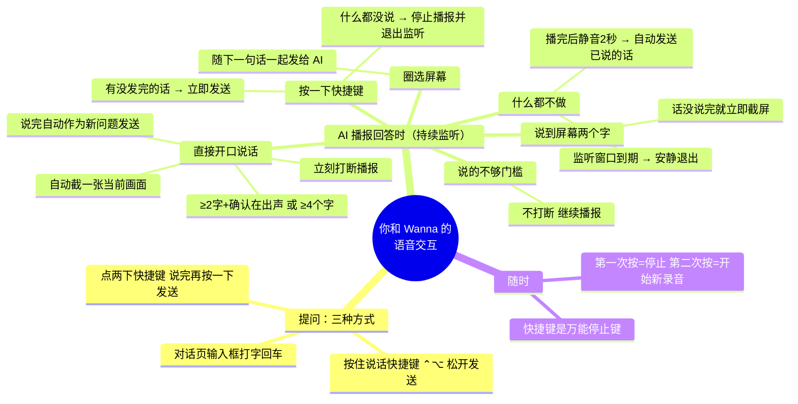

# 语音打断与持续监听 —— 完整解决方案

> **任务状态：基本全部完成（2026-09-23）。** 用户实测确认：「当前这个方案已经完整解决了我的问题，而且没有出现任何问题。」当天稍晚打断延迟又修了一轮（门槛从 4 字降到「2 字 + 电平确认」，见 4.3 与 [`开发经验/09-实测数据.md`](../开发经验/09-实测数据.md) 第九节），修完用户再确认：「现在基本上比之前要好很多了。」
>
> 解决的核心问题：AI 播报回答时会**自己打断自己**（约 40% 的回复，尤以第一次播报最频繁），以及打断之后"说完了怎么发送、不说话怎么停止"的整套交互。

---

## 一、打断是怎么实现的，整个工作流程

### 1.1 为什么会自己打断自己（根因）

 Wanna 的回答是语音播报的，播报期间麦克风一直在听（持续监听）。要让麦克风听得到用户说话又不被 AI 自己的声音骗到，靠的是系统的**回声消除（AEC/VPIO）**——它需要"参考信号"才知道该从麦克风里减掉什么。这里有一条铁律：

> **AEC 只对走同一条音频链路的播放有参考信号。** Apple WWDC23《What's new in voice processing》明确：其他任何音频流都是"other audio"，只会被压低音量，永远不会被消除。参考项目 VoiceWeb 把同样的规则记成架构红线（`README.md` 技术要点 #1：把播放挪出 WebRTC → AEC 失灵 → AI 自己打断自己）。

第一个版本就是踩在这里：麦克风开在 AEC 引擎上，但 TTS 走的是另一个播放器 → AEC 无参考 → **每条回复都触发"有人在说话"→ 自我打断**。

修成共享引擎之后还有第二层坑：**AEC 的自适应滤镜需要时间收敛，而播放引擎每条回复都是重新启动的**。每次回复开头的那零点几秒，滤镜从零学起，AI 自己的声音几乎原封不动地进了麦克风——实测这期间电平会冲过 0.25 的"有人在说话"阈值。这就是"第一次播报最容易自己打断"的物理原因。

### 1.2 最终架构：共享一个引擎 + 内容判据

两个关键决策：

1. **TTS 播放和持续监听采集共用同一个 `AVAudioEngine`**（`VoicePlaybackEngine`）——AEC 才有参考信号。
2. **电平不再能单独触发打断；机器人在说话时，只有"识别出了字"才能打断。** 这是官方 pipecat 框架的规则（见第三节），因为电平在物理上无法区分"我们自己的声音"和"用户的声音"：
   - 滤镜收敛后：残留回声峰值 **0.111**，比安静房间的底噪 **0.167** 还低；
   - 滤镜没收敛时：自己的声音比正常说话还响（> 0.25）。
   - 同一个信号横跨整个动态范围——用音量区分，物理上不成立。**只有内容能分。**

### 1.3 完整工作流程（状态机）

```
用户提问（按住/双击快捷键、或打字）
        │
        ▼
┌─ AI 开始播报 ──────────────────────────────┐
│  同时开启【持续监听窗口】（默认 30s，可调 10–120s）：        │
│  播放引擎 + 麦克风 tap + VPIO(AEC) + 一个 ASR 识别会话        │
│                                                            │
│  两条监听路径并行跑：                                        │
│  ① 电平路径：50ms 轮询，电平≥0.25 累积 0.20s → 只"开启一轮聆听"      │
│     （AI 在说话时它不能打断——它带的常常是我们自己的回声）          │
│  ② 识别路径：识别器吐出的字够门槛 → "开启一轮聆听" 并允许打断        │
│     门槛两条（见 4.3）：≥2 字 + 最近 0.5s 电平峰值≥0.25（快路径，   │
│     识别器第一个 interim 就触发，约 0.5s ≈ 2～3 个字）；            │
│     或 ≥4 字（电平不确认时的兜底）                                │
│                                                            │
│  ⇒ 触发打断：立刻停播报 + （若开了「追问时自动截屏」）截一张当前画面 │
└────────────────────────────────────────────┘
        │
        ▼
【一轮聆听】进行中，累积识别文本
        │
        ├─ 静音超过「静音多久自动发送」（默认 2.0s，用户可调 1–5s）
        │  或单句超 15s 上限
        │       │
        │       ▼
        │  请求最终识别结果（带 2.4s 宽限兜底，见第五节问题 6）
        │       │
        │       ├─ 最终文本 ≥4 个字 → 作为【全新问题】走完整管线
        │       │   （截屏→视觉模型→播报→重新开监听窗口，无限连续追问）
        │       └─ 不足 4 个字（"嗯。""啊。"之类）→ 丢弃，继续听
        │
        ├─ 用户按一下说话快捷键
        │       ├─ 有还没发出去的话（≥4 字或最终结果已在路上）→ 立即发送
        │       └─ 什么都没说 → 停止播报 + 退出监听（不打断成录音）
        │
        └─ 窗口到期 → 播报放完后安静退出，麦克风灯灭
```

两条路径的判定矩阵（`markContinuousListeningUtteranceActive` 的核心，两个决策分开做）：

| AI 在说话？ | 触发来源 | 开启一轮聆听 | 打断播报 |
|---|---|---|---|
| 否 | 电平升高 | ✔ | ✔ |
| 否 | 识别出字 | ✔ | ✔ |
| **是** | **电平升高** | ✔ | ✘ ← 回声，等字 |
| **是** | **识别出字** | ✔ | ✔ ← 真人在说话 |

两个决策分开的原因：电平路径通常先响，如果用同一个标志位，先到的电平会否决后到的文字——所以"能否打断"和"是否开启聆听"各用各的证据，打断用一次性标志 `continuousListeningDidRequestBargeIn` 保证一轮最多触发一次。

### 1.4 扬声器为什么还能正常播放（整个方案最容易被误解的一环）

持续监听意味着「麦克风一直开着」，最直接的问题是：系统声音——音乐、视频、以及 AI 自己的回答——会不会被录进去？Wanna 的答案不是「把扬声器关掉」，而是**把时间切成三段，每段交给不同的机制**：

| 时间段 | 扬声器状态 | 谁在防线值班 |
|---|---|---|
| 录音中、且没在播报 | 其他 App 的声音正常播放 | **录音静音**（`SystemSpeakerMuteCoordinator`）：只有这一段静音系统扬声器——被静音的扬声器发不出声，声音进不了麦克风 |
| AI 正在播报 | **不静音，回答照常被听见** | **AEC（VPIO）**：回答的声音从共享引擎出发，AEC 有参考信号，把它从麦克风信号里减掉 |
| 每条回复开头 AEC 尚未收敛的零点几秒 | 正常播放 | **内容判据**：电平路径此时无权打断，只有识别出了字才允许打断 |

关键点，一条一条说：

1. **录音静音只负责「没在播报」的段。** 它的判据是 `recording && !TTS-playing`——播报一开始静音就抬起，否则用户就听不到回答了。这正是本需求的核心矛盾：**既要扬声器响（用户要听答案），又要麦克风干净（不能把自己的答案听成用户的话）**。矛盾的两头各归一个机制管，谁也不欠谁。
2. **播报段交给 AEC，而 AEC 有官方写明的硬约束（WWDC23《What's new in voice processing》）：它只能消除「走同一条 voice-processing 链路」的音频。** 所以 TTS 播放必须和麦克风 tap 在同一个 `AVAudioEngine` 上——1.2 的共享引擎决策，就是为了让这一段成立。其他 App 的音乐在这个段里只会被「压低」（ducking）而不会被消除：macOS 会把开了 VPIO 的 App 归为 FaceTime / Zoom 那一类「通讯类 App」，并自动压低别的应用的音量。压低的**级别**在 macOS 14+ 可调，Wanna 钉死在最低一档（`voiceProcessingOtherAudioDuckingConfiguration` 关闭高级压低 + `.min`）——默认档曾被用户抱怨压得太狠，VPIO 为此被移除过一次，同一天因为自我打断问题复发又装了回来，从此不再动这个档位。
3. **VPIO 还有一条不写进文档的启动顺序**：必须先读一次 `mainMixerNode` 的输出格式（实例化混音器），再开 voice processing；反序 `engine.start()` 必挂 `-10875`，丢掉每条回复的第一个播报段。四种顺序各跑一遍实测出来的（见五、问题 2）。
4. **为什么内容判据还要压在 AEC 之下**：AEC 是自适应滤镜，不是开关。播放引擎按需启停，每条回复开头滤镜从零收敛，这零点几秒回声几乎原样进麦克风（实测电平冲过 0.25）。所以「AI 说话时电平不许打断」这条规则**永久保留**——它兜的正是 AEC 收敛前的这个窗口。收敛后的残留回声实测峰值 0.111，比安静房间底噪 0.167 还低，此时内容判据对正常使用是零成本的。

一句话总结整个声音方案：**静音管住「安静段」，AEC 管住「播报段」，内容判据管住「AEC 还没学好的那一小段」——三段无缝衔接，扬声器从头到尾该响就响。**

---

## 二、用户的操作逻辑（脑图）



---

## 三、参考了哪个项目、哪些文档、哪些代码

### 3.1 参考项目：VoiceWeb（`~/Documents/SuperAgent/APP/Test/voice-web`）

pipecat 框架 + FastAPI 的语音项目，**它的 AEC 是被证明可靠的**（浏览器 WebRTC），整个方案的方向由它确立：

| 参考点 | 位置 | 学到什么 |
|---|---|---|
| 架构红线 | `README.md` 技术要点 #1 | 「音频必须采集+播放都在同一传输里，AEC 需要参考信号；挪出去就会 AEC 失灵 → 自己打断自己（之前踩过的坑）」——这就是共享引擎决策的直接出处 |
| 轮次策略接线 | `server.py:3722–3724` | `_start += [VADUserTurnStartStrategy(...), TranscriptionUserTurnStartStrategy(...)]`——VAD 和转写两条开始策略并行，和 Wanna 的两条监听路径同构 |
| VAD 参数 | `server.py:3733` | `SileroVADAnalyzer(params=VADParams(stop_secs=0.6))`——句末静音 0.6s 的官方取值参考 |
| 打断开关 | 同上 `enable_interruptions` | 打断是策略开关，不是裸电平事件 |

### 3.2 参考框架：pipecat（`voice-web/reference/pipecat/src/pipecat/`）

| 参考点 | 位置 | 学到什么 |
|---|---|---|
| **最关键的一条** | `turns/user_start/min_words_user_turn_start_strategy.py:108` | `min_words = self._min_words if self._bot_speaking else 1`——**机器人在说话时要求更多字才认定用户开口**。这正是"AI 说话时电平不算数、必须以识别内容为准"的官方出处。本次 40% 自我打断的修复直接以它为依据 |
| VAD 分析器接口 | `audio/vad/vad_analyzer.py` | 本地电平 VAD 循环的参数组织方式 |

### 3.3 官方文档

- **Apple WWDC23《What's new in voice processing》**：AEC 的参考信号规则——只取消同一条 voice-processing 链内的音频。这是共享引擎方案的理论依据。
- **Apple AVFoundation**：`AVAudioEngine` / `AVAudioUnitTimePitch` / `AVAudioConverter` 的标准接法（播放链 `playerNode → timePitch → mixer`）。

### 3.4 落到本项目的文件

| 文件 | 承担的部分 |
|---|---|
| `leanring-buddy/VoicePlaybackEngine.swift`（新） | 共享引擎本体：播放半边（WAV 解码→TimePitch→播放）+ 采集半边（监听 tap）+ VPIO 懒开启 |
| `leanring-buddy/BailianTTSClient.swift` | 播放改走共享引擎；逐句快答分段合成 |
| `leanring-buddy/BuddyDictationManager.swift` | 持续监听状态机：两条监听路径、两个决策的打断门、静音发送、快捷键发送、宽限兜底 |
| `leanring-buddy/CompanionManager.swift` | 窗口编排：播报开始→开监听、打断→停播报+截屏、最终文本→全新问题管线 |
| `leanring-buddy/BailianRealtimeTranscriptionProvider.swift` | 流式识别 websocket；假警告修复 |
| `leanring-buddy/BuddyScreenKeywordDetector.swift`（新） | 「说到"屏幕"立即截屏」的边沿触发检测 |
| `leanring-buddy/AppSettings.swift` + `GeneralSettingsView.swift` | 5 个设置项的落盘与界面 |

---

## 四、具体用了什么策略、什么方法

### 4.1 分层防御（一共六层，每层只信一种证据）

| 层 | 机制 | 防什么 |
|---|---|---|
| ① 硬件层 | VPIO/AEC，播放与采集同引擎（参考信号规则） | 消掉绝大部分自己的声音 |
| ② 电平层 | 阈值 0.25 + 0.35s 防抖（实测房间底噪峰值 0.167，旧值 0.06 在底噪以下） | 房间噪声误触发；**只开启聆听，不能打断** |
| ③ 内容层 | AI 说话时打断必须由识别内容证实：**≥2 字 + 电平确认**（快），或 **≥4 字**（无电平证据时的兜底） | **AEC 未收敛期的自我打断（本次 40% 问题的最终解）**；2026-09-23 起再降延迟（见 4.3） |
| ④ 成句层 | 最终结果 ≥4 个字才算一个新问题 | "嗯。""啊。"这类回声碎字变成提问 |
| ⑤ 节奏层 | 静音 2.0s 自动发送（用户可调）+ **快捷键=显式发送** | 人类思考停顿不可预测——自动等不靠谱，快捷键才是"我说完了" |
| ⑥ 兜底层 | 识别会话死亡后 2.4s 宽限提交中间结果 | websocket 静默死亡导致"说完了没反应" |

### 4.2 方法论

1. **"能不能打断"和"要不要开始听"是两个问题，分开判**——不同的问题用不同的证据，避免一条路径否决另一条。
2. **电平只做"有人在出声"，内容才做"是人在说话"**——pipecat 官方策略的直接翻译。
3. **快捷键是语义锚点**：静音计时永远不可能完美，让用户按一下快捷键表达"我说完了"，比任何阈值都可靠。
4. **一切结论以实测为准**：底噪 0.167、收敛回声 0.111、打断率 46%、识别器首个 interim 0.52 s、4 字门槛把打断推到 1.44 s，全是拿真实日志和真实服务量出来的，不是猜的。
5. **瓶颈要找对层**：用户报的是"说到第 7～8 个字才停"，直觉会去怪识别服务。实测一下发现识别器 0.52 s 就给可用结果了——**慢的是 App 自己的门槛**，改一行常量比换服务商有效得多。先量再改。

### 4.3 打断门槛为什么要两条（2026-09-23 起）

用户原话：「我只有在说到第 7～8 个字的时候，它才会自动停止……我希望最好是，我说第一个字的时候，它瞬间就停。」

**实测（`09-实测数据.md` 第九节有完整表）**：识别器 **0.52 s** 就送出第一个 interim，已经带 2 个内容字符；第一个够 4 个字的 interim 在 **1.44 s**——按 5 字/秒就是说出第 7 个字。**「4 字门槛」本身就是那 1 秒延迟的全部来源。**

**为什么不能直接把 4 改成 2**：门槛防的是识别器自己编的东西。喂它一个安静房间，它凭空给出「嗯。」，当时电平只有 0.046 / 0.078，而真人说话是 0.3–1.0、语音门槛是 0.25。**编出来的东西是轻的。**

所以：

| 证据 | 门槛 | 结果 |
|---|---|---|
| ≥2 内容字符 **且** 最近 0.5 s 电平峰值 ≥0.25 | 2 | **打断**（识别器第一个 interim 就触发，约 0.5 s ≈ 2～3 个字） |
| ≥4 内容字符，电平不确认 | 4 | 打断（保持旧行为，说话轻声的人不会退化到"完全打不断"） |

**窗口取峰值不取瞬时值**：连续中文说话 p50 只有 0.159，一半时间在 0.25 以下。「现在这一刻够不够响」有一半概率答错。

**注意区分两个 4 字**：打断门槛是"要不要停播报"，发送门槛（④成句层）是"这些话要不要变成一个提问"。**发送门槛不动**——所以「等一下」（3 字）会停掉播报但不成为提问，这正是说这句话的人要的。

### 4.4 相关设置（都在「听（识别）」「看与截图」页）

| 设置 | 默认 | 说明 |
|---|---|---|
| 回答时持续监听 | 开 | 播报期间持续聆听 |
| 静音多久自动发送 | 2.0s（1–5s 可调） | 句末静音判据 |
| 监听时长 | 30s（10–120s） | 窗口长度 |
| 追问时自动截屏 | 开 | 打断瞬间抓一张当前画面 |
| 说到"屏幕"立即截屏 | 开 | 话没说完就截 |

---

## 五、实现过程中遇到的问题，以及最后几次是怎么检修的

整个功能前后修了八轮。每一轮都留下了"证据 → 判定 → 修法"的完整链条，这里按时间顺序记录（详细实测数据在 `开发经验/09-实测数据.md`，通用排查法在 `开发经验/13-顽固问题排查法.md`）：

**问题 1｜自我打断（第一版，100% 复现）**
现象：每条回复一开始播报就被掐断。
检修：读 VoiceWeb 的 README（技术要点 #1）+ WWDC23 → 根因是 TTS 播放和麦克风不在同一条链路，AEC 没有参考信号。修法：**整个 `AVAudioPlayer` 播放路径废弃，所有播改进共享引擎**。

**问题 2｜改完共享引擎后，TTS 直接没声音（-10875）**
现象：引擎启动失败，错误码 `-10875`。
检修：用独立探针程序把"VPIO 先开/后开 × 图先连/后连"四种顺序各跑一遍 → **macOS 上必须先连播放图、再开 VPIO**，反序必挂。修法：`ensureEngineStarted` 调整顺序；VPIO 真开不了就**不带 AEC 重试一次**——播放绝不能因为回声消除这个"便利功能"而死。

**问题 3｜「即便我没有说话它也循环」**
现象：安静时也不断触发监听。
检修：实测安静房间底噪峰值 **0.167**，旧阈值 0.06 在底噪以下——房间本身就是"有人在说话"。修法：阈值提到 **0.25**（正常说话实测 0.3–1.0）。

**问题 4｜40% 自我打断（本次最关键的一次）**
现象：用户报告约 40% 的回复（尤其第一次播报）还是被自己打断，音量大小解释不了。
检修链条（这次检修的方法值得完整保留）：
1. App 用 `script -q -a ~/Library/Logs/Wanna/clicky.log` 方式重启，留全量日志；修前日志归档为 `clicky-before-bargein-fix.log`。
2. 用 awk 把"打断日志行"和"回复日志行"做时间关联 → **13 条回复被 6 次提前打断（46%），对上用户说的 40%**。
3. 看每次打断的触发来源 → **11 次电平触发的打断全部带着空白识别文本**（`transcript: ""`）——识别器一个字都没听到，说明那是回声不是人声。
4. 实测收敛后的回声峰值 0.111（低于底噪）vs 未收敛时 >0.25 → 证明**任何阈值都分不开这两种状态**，必须换证据类型。
5. 查官方框架 → pipecat `min_words_user_turn_start_strategy.py:108` 早有此规则（AI 说话时要求更多字）。
6. 修法：两个决策分离 + 一次性打断标志（见第一节矩阵）。

**问题 5｜「按两次快捷键才能停止播放」**
现象：播报时按一次快捷键停不下来。
检修：日志里识别器会从 AI 自己漏出的声音里吐出「啊。」「嗯。」「中间。」这类 1–2 个字的假中间结果，旧的">0 字就算有话"判据全部放行。修法：pending 判据收紧到 **≥4 个有效字**，且"确认过但为空的一轮"不算数。

**问题 6｜「说完它也不回复」**
现象：说完话，等了很久没有任何反应。
检修：百炼 websocket 会以 "Socket is not connected" 静默死亡——**既不给最终结果也不报错**。修法：请求最终结果时先记下最新中间文本，等 2.4s；超时就取消死会话、用中间文本顶上（代际计数防止旧定时器取消新请求）。

**问题 7｜日志里 20 条假警告（差点带偏排查方向）**
现象：大量 `⚠️ No session.updated within 3.0s`，看起来像握手失败。
检修：awk 证明每次握手实际都是成功的（`requested`→`ready` 永远只隔一行）——是成功之后**超时定时器没被取消**，3 秒后照常打印。修法：解析完成时取消定时器。教训：**假警告和真故障长得一样，先验证再相信**。

**问题 8｜「音色还是机器人的音色」**
现象：语速调快后声音变尖变假。
检修：实测 Varispeed 1.4× 时基频 321.9 Hz（变调 1.38 倍）vs TimePitch 1.4× 时 233.3 Hz（不变调）——Varispeed 是"磁带变速"，快了就尖。修法：换 `AVAudioUnitTimePitch`。

### 排查方法沉淀（三次都用上）

1. **日志先行**：改动前归档旧日志，改动后全量新日志；自我打断这类"偶发"问题，靠的是把打断行和回复行做**时间关联统计**，而不是复现一次看一次。
2. **两次不成，必须查官方**：本次问题 4 自己试错两轮无果后，直接读 pipecat 官方源码，一击命中。官方框架里几乎总有一条为这个问题写好的规则。
3. **每个数字都有出处**：0.25、0.167、0.111、46%、2.4s、0.52s、1.44s、2 字 / 4 字——全部来自实测，写进代码注释和本文档，下一个改这里的人不用重新踩。
